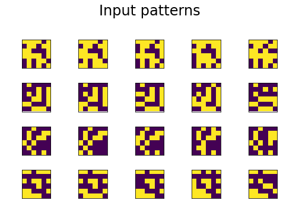
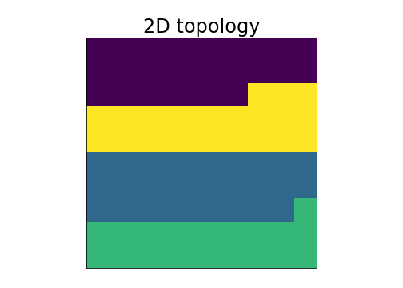

# Self-organizing map (1982)

## Self-organizing map for unsupervised machine learning

### Table of Contents

- [Images](#images)
- [Description](#description)
- [Keywords](#keywords)
- [How to Use](#how-to-use)
- [References](#references)
- [Author Info](#author-info)

## Images

## Description

"Self-organizing map for unsupervised machine learning."

#### Technologies

- Python programming language

## Keywords

 - Kohonen map
 - Unsupervised learning
 - Competitive learning
 - Topological structure
 - Low-dimensional representation

## How to Use

#### Getting started

`git clone https://github.com/berberianareg/self-organizing-map.git`

#### Dependencies

see requirements.txt

#### Installation

`pip install numpy`

`pip install matplotlib`

#### Executing the program from command line

`python SOM.py`

#### API Reference

## References

#### Links

- Wikipedia - (https://en.wikipedia.org/wiki/Self-organizing_map)
- Relevant paper - (https://doi.org/10.1016/j.neunet.2009.06.011)

## Author Info

- Twitter - [@berberianareg](https://twitter.com/BerberianNareg)
- LinkedIn - [Nareg Berberian](https://www.linkedin.com/in/nareg-berberian-phd-ab6759b9/)

[Back to the Top](#self-organizing-map-1982)

